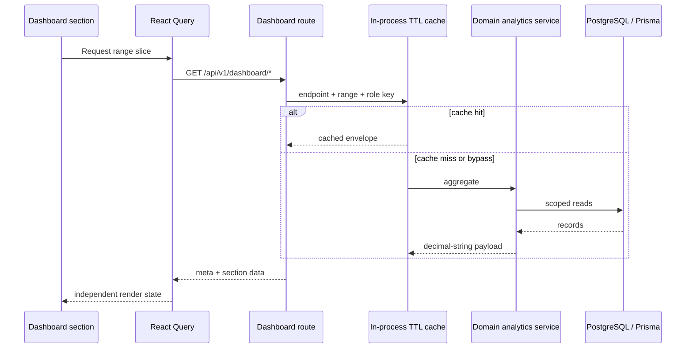

# Dashboard Analytics Data Flow

## Correctness Boundaries

- Customer balances use the financial domain balance and status helpers.
- Voided allocations use `isPaymentAllocationVoided`.
- Status uses `todayInBusinessTimezone()`.
- `PREPAID_PURCHASE` never contributes to customer debt totals.
- Supplier credits and payments reduce owed according to transaction direction.
- Money leaves the API through `moneyToApiString`.
- Month-end is recomputed live; retroactive corrections can restate a closed month.

## Endpoint Cache And Access

| Endpoint | TTL | Access |
|---|---:|---|
| `/overview` | 20 seconds | Authenticated |
| `/customer-financial` | 45 seconds | Authenticated; top debtors ADMIN only |
| `/supplier-financial` | 45 seconds | Authenticated |
| `/service-summary` | 45 seconds | Authenticated |
| `/product-summary` | 5 minutes | Authenticated |
| `/alerts` | 45 seconds | Authenticated; offender identities role-filtered |
| `/activity` | 20 seconds | Authenticated |
| `/month-end` | 60 seconds current, 15 minutes closed | ADMIN only |

Send `x-dashboard-refresh: true` to bypass cache. A section error stays local and does not unmount the rest of the page.

