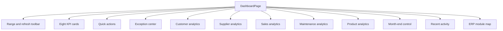

# ERP Dashboard Information Architecture

The HomeConnect dashboard is a read-only, backend-authoritative command center. Every headline value is calculated by a backend domain slice and money is returned as a decimal string.

## Page Structure



## KPI Catalog

| KPI | Backend source | Rule |
|---|---|---|
| Collected today | Customer analytics | Non-voided payments dated on the business date |
| Customers paid today | Customer analytics | Distinct customer IDs among those payments |
| New debts today | Customer analytics | Standard debts and plans created today; prepaid excluded |
| Outstanding debt | Customer analytics | Allocation-aware debt and installment balances |
| Owed to suppliers | Supplier analytics | Active increases minus active decreases |
| Open service jobs | Service analytics | All non-terminal statuses |
| Ready for pickup | Service analytics | `READY_FOR_PICKUP` count |
| Active products | Product analytics | Products with `isActive = true` |

Twelve charts are shipped: collections vs new debt, six-month comparison, top debtors, debt age distribution, supplier payment trend, five sales charts, service status distribution, and month-end debt movement. The sales charts cover sales by day, payment and fulfillment distributions, the delivery pipeline, and catalog-backed top products. Every chart has a tooltip and a table-view toggle.

```mermaid
graph LR
  KPIs[KPI strip] --> Overview[/dashboard/overview]
  CustomerCharts[Customer charts] --> CustomerAPI[/dashboard/customer-financial]
  CustomerAPI --> Debt[(Debt)]
  CustomerAPI --> Plans[(InstallmentPlan)]
  CustomerAPI --> Payments[(Payment)]
  SupplierCharts[Supplier chart] --> SupplierAPI[/dashboard/supplier-financial]
  SupplierAPI --> SupplierTx[(SupplierTransaction)]
  SalesCharts[Sales charts] --> SalesAPI[/dashboard/sales-summary]
  SalesAPI --> SalesOrders[(SalesOrder)]
  SalesAPI --> SalesItems[(SalesOrderItem)]
  ServiceCharts[Service chart] --> ServiceAPI[/dashboard/service-summary]
  ServiceAPI --> Jobs[(ServiceJob)]
  ProductSection[Product readiness] --> ProductAPI[/dashboard/product-summary]
  MonthControl[Month-end] --> MonthAPI[/dashboard/month-end]
```

Sales value and receivables are deliberately separate metric families. Sales cards aggregate `SalesOrder.totalAmount`; outstanding, collected, and overdue figures continue to come only from Debt, Installment, and Payment Allocation data. The dashboard never adds those families together.

## Responsive And Language Rules

| Width | KPI strip | Analytics | Month-end |
|---|---|---|---|
| 1280px and above | 4 by 2 | Two-column where useful | Three columns |
| 768px to 1279px | 2 by 4 | Stacked or two-column | Three compact columns |
| Below 768px | 2 columns | Stacked | Stacked |

The interface stays LTR. Arabic labels apply `dir="rtl"` only to the Arabic text span. User-entered text uses `dir="auto"`.
