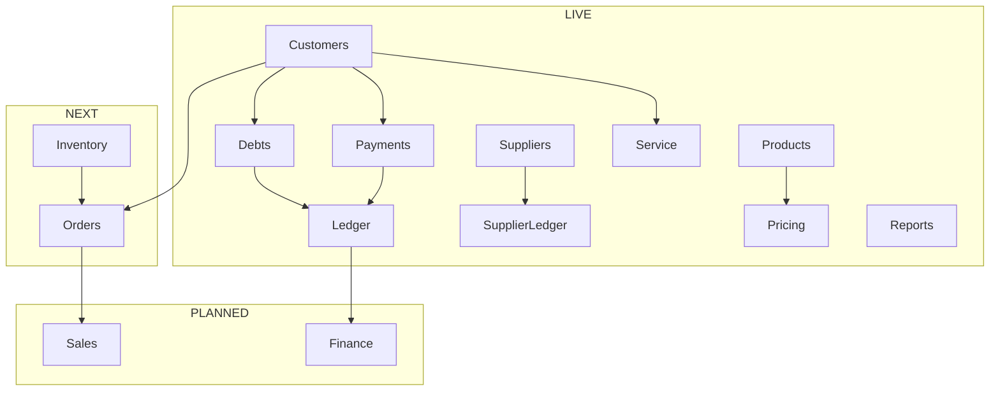

# ERP Module Map

`frontend/src/features/dashboard/config/module-registry.ts` is the source of module names, Arabic labels, Lucide icons, routes, status, and accents.

| Status | Behavior |
|---|---|
| LIVE | Full-color, routed, and optionally displays a live count |
| NEXT | Muted, outlined, non-interactive, marked Coming next |
| PLANNED | Muted, outlined, and non-interactive |

## Adding A Module

1. Add or change one registry entry with a Lucide icon and route.
2. Add an isolated backend analytics slice if dashboard metrics are required.
3. Add one dashboard section and hook without changing unrelated sections.

Future modules remain non-clickable until their workflow exists.

